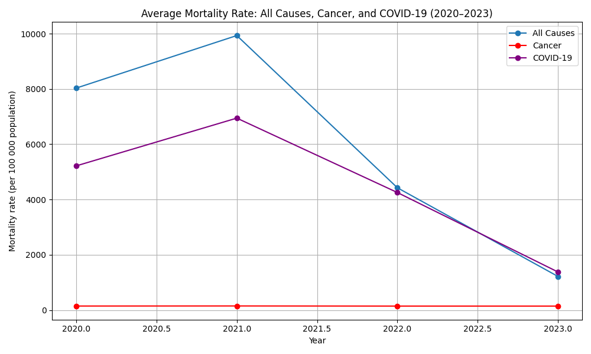
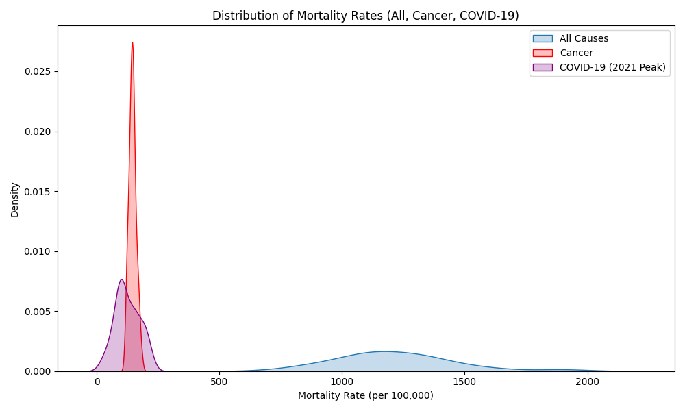
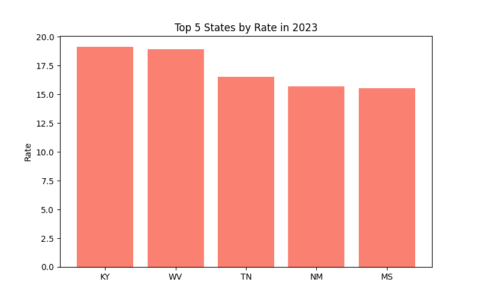
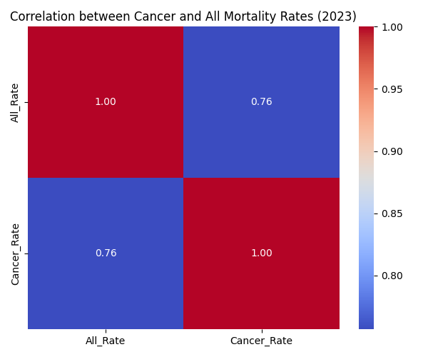
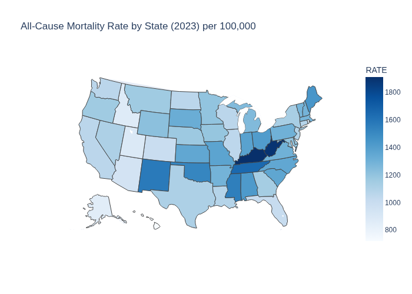
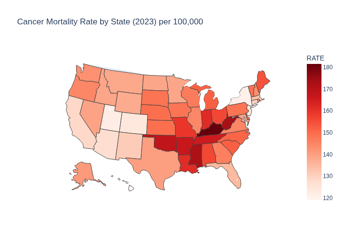
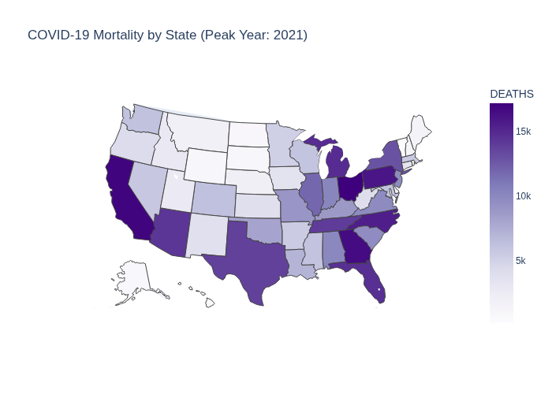

# 🩺 State Mortality Dashboard (2020–2023)

This small project visualizes U.S. state-level mortality data using Python, Pandas, and Flask. It loads real NCHS data, creates simple charts, and serves them in a minimal web app.

## 🚀 How to Run in Codespaces

1. Clone this repo or upload your files.
2. Open a terminal and install dependencies:
   ```bash
   pip install -r requirements.txt
3. Run the data analysis:
   ```bash
   python scripts/analyze_data.py
4. Start the Flask web app:
   ```bash
   python app.py
   
---

## 📈 Data Insights Summary

### 1️⃣ Average Mortality Rate by Year
The line chart shows a **sharp decline** in the average mortality rate from 2021 to 2023.  
- **2020–2021:** The mortality rate spiked significantly, reflecting the peak of the COVID-19 pandemic.  
- **2021–2023:** Rates dropped steeply, suggesting recovery and stabilization as the pandemic waned.  

**Key takeaway:** The data shows a clear **post-pandemic improvement** in mortality rates across the U.S.

---

### 2️⃣ Top 5 States by Rate in 2023
The bar chart highlights the five states with the highest mortality rates in 2023:
- **Kentucky (KY)**
- **West Virginia (WV)**
- **Tennessee (TN)**
- **New Mexico (NM)**
- **Mississippi (MS)**

These states, concentrated in the **Southern and Appalachian regions**, tend to have higher rates of chronic disease, poverty, and limited healthcare access.

**Key takeaway:** Persistent **regional health disparities** remain a challenge even as national averages improve.

---

### 3️⃣ Overall Interpretation
| Year | Trend | Explanation |
|------|--------|-------------|
| 2020 | High | Early pandemic impact |
| 2021 | Peak | Height of pandemic mortality |
| 2022 | Decline | Vaccination and recovery phase |
| 2023 | Stabilized | Return to near pre-pandemic rates |

**Conclusion:**  
The dataset reflects a story of **crisis and recovery** — a national health rebound after COVID-19, with regional outliers that highlight ongoing inequality in access to care and preventive health outcomes.

### 📊 Extended Analysis

The project now includes:
- **Comparative trend visualization** of all-cause and cancer mortality (2014–2023)
- **Correlation heatmap** showing how closely cancer mortality tracks with total mortality across states
- **Interactive maps** rendered with Plotly (Flask-based web interface)
- **Static insights** saved as PNGs in `/static/`

#### Insights:
- The **average U.S. mortality rate** has shown gradual decline after 2021, following pandemic peaks.
- **Cancer mortality** remains a smaller yet steady fraction of total mortality.
- States with higher total mortality (e.g., KY, WV, MS) also show **strong correlation** with cancer mortality rates.
- The heatmap confirms a **positive correlation (~0.8–0.9)** between total and cancer-specific mortality by state.
- **COVID-19 (2021 peak)** added significant short-term spikes but did not change long-term chronic mortality patterns.

## 📸 Visuals from Analysis

### 1️⃣ Average Mortality Rate (All Causes, Cancer, COVID-19)


### 2️⃣ Mortality Distribution (All, Cancer, COVID)


### 3️⃣ Top 5 Cancer Mortality States


### 4️⃣ Cancer Share of Total Deaths


### 5️⃣ Correlation Between All-Cause and Cancer Mortality


### 6️⃣ Cancer Rate vs Death Count


### 7️⃣ All-Cause Mortality Heatmap


### 8️⃣ Cancer Mortality Heatmap


### 9️⃣ COVID-19 Mortality Heatmap (2021 Peak)


